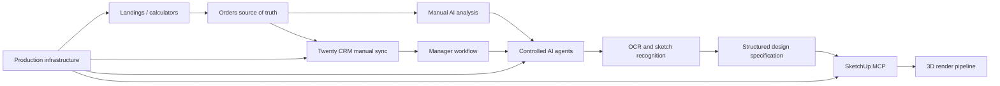

# Project Progress Dashboard

Last reviewed: 2026-06-12
Current checkpoint: 2
Next checkpoint review: after 5 more completed slices

Current product focus: prepare the first paid landing while selecting the next product layer after completing landing and calculator production verification.

This is the canonical visual progress tracker for the complete furniture platform. Percentages are engineering estimates based on implemented, tested, deployed, and operationally verified behavior. A feature is not considered complete only because code exists.

## Product Readiness

| Target | Progress | Meaning |
|---|---:|---|
| Commercial platform | `[########--] 75%` | Landings, orders, calculators, portfolio, CRM, and stable operations |
| AI-assisted platform | `[####------] 40%` | AI qualification, communication assistance, OCR, and controlled agents |
| Complete vision | `[###-------] 30%` | Commercial platform plus vision, SketchUp MCP, and 3D render pipeline |

## Workstreams

| Workstream | Progress | Status | Next meaningful result |
|---|---:|---|---|
| Lead intake and order workflow | `[########--] 80%` | Working | Production hardening and deeper manager workflow |
| Calculators | `[##########] 100%` | Production embed and lead path verified | Repeat the documented flow for the first paid landing |
| Landing platform | `[##########] 100%` | Production publish and customer-domain HTTPS verified | Repeat the documented flow for the first paid landing |
| Portfolio and media | `[######----] 60%` | Working | Complete production R2 operations |
| Production infrastructure | `[#########-] 90%` | Admin proxy, VPS deploy, and proxied landing HTTPS verified | Origin Certificate hardening and observability |
| Manual AI analysis | `[#######---] 70%` | Working locally | Explicit production enablement decision |
| Twenty CRM integration | `[#######---] 70%` | Manual platform sync path complete | Configure Twenty workspace and run successful production sync |
| AI agents and communications | `[#---------] 10%` | Planned | Tool permissions and human approval model |
| OCR and sketch recognition | `[----------] 0%` | Planned | Safe document/image intake prototype |
| SketchUp MCP | `[----------] 0%` | Planned | Windows node and controlled MCP prototype |
| 3D rendering pipeline | `[----------] 0%` | Planned | Render contract after SketchUp prototype |

## Dependency Map

## Current Delivery Sequence

| Order | Stage group | Completion rule | State |
|---:|---|---|---|
| 1 | Landings and calculators completion | Paid landing order can move from brief to preview lead | Complete through LC Slice 7 production verification |
| 2 | Landing production infrastructure | VPS/domain/SSL/deploy path verified for customer sites | LC Slice 6 operationally verified with Cloudflare proxied HTTPS |
| 3 | Twenty CRM Slices 3-7 | Manual order-to-CRM sync works from admin | Paused |
| 4 | Communication channels | Customer conversations are attached to order/contact history | Planned |
| 5 | Controlled AI agents | Agents can suggest or perform approved actions with audit history | Planned |
| 6 | OCR and vision | Text, measurements, and sketch details produce reviewed structured data | Planned |
| 7 | SketchUp MCP prototype | Structured order creates or updates a controlled SketchUp model | Planned |
| 8 | 3D render pipeline | Render output returns to the order and CRM workflow | Planned |
| 9 | Full production hardening | Security, recovery, observability, and end-to-end QA pass | Planned |

## Twenty CRM Detail

| Slice | Result | Status |
|---:|---|---|
| 1 | Integration decision | Complete |
| 2 | Pure order-to-Twenty mapper | Complete |
| 3 | Request builder without network calls | Complete |
| 4 | Twenty sender with injected fetch | Complete |
| 5 | Manual sync core | Complete |
| 6 | Admin-protected sync endpoint | Complete |
| 7 | Admin sync control | Complete |
| 8 | Optional webhooks | Optional |
| 9 | MCP and AI agents | Optional after stable sync |

## Checkpoint Rules

- Update workstream status after every completed stage or slice.
- Recalculate progress percentages after every 5 completed slices.
- At every checkpoint, verify tests, production gaps, security risks, and the next delivery sequence.
- Mark a workstream as complete only when code, tests, documentation, and required operational verification are complete.
- Record major scope or dependency changes in the relevant decision document and `SESSION_NOTES.md`.

## Checkpoint History

| Checkpoint | Date | Completed since previous review | Main decision |
|---:|---|---|---|
| 1 | 2026-06-09 | Twenty CRM decision and pure mapper | Finish manual CRM sync before agent automation |
| Focus change | 2026-06-09 | Progress handoff created | Finish landings and calculators before resuming CRM |
| 2 | 2026-06-10 | LC Slices 1-5 | Structured landing editor and calculator flow are locally complete; move to production publishing |
| Ops pass | 2026-06-10 | LC Slice 6 Pages/D1 release | Production migrations and Pages deploy complete; VPS HTTPS/control service remains blocked by missing SSH credentials |
| Ops completion | 2026-06-11 | LC Slice 6 VPS/domain/HTTPS path | Public demo HTTPS verified; recurring failures and solutions recorded in `LANDING_VPS_OPS_RUNBOOK.md` |
| Product completion | 2026-06-11 | LC Slice 7 calculator production path | Published calculator embedded into demo landing and production lead persisted with versioned calculator metadata |
| CRM restart | 2026-06-11 | CRM Slice 3 request builder | Pure versioned request objects complete; verify installed Twenty API paths before adding sender |
| CRM sender | 2026-06-12 | CRM Slice 4 guarded sender | Injected-only sender complete; no real API, endpoint, UI, migration, deploy, or production change |
| CRM platform path | 2026-06-12 | CRM Slices 5-7 | Manual core, persistence, endpoint, and admin control complete; real Twenty workspace remains external |
