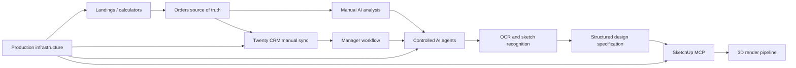

# Project Progress Dashboard

Last reviewed: 2026-06-14
Current checkpoint: 3
Next checkpoint review: after 5 more completed slices

Current product focus: restore the VPS operational path and use the verified
manual AI analysis flow safely on synthetic/test data.

This is the canonical visual progress tracker for the complete furniture platform. Percentages are engineering estimates based on implemented, tested, deployed, and operationally verified behavior. A feature is not considered complete only because code exists.

Interactive visual companion: [`PROJECT_PROGRESS.html`](PROJECT_PROGRESS.html).
After every completed stage, update this Markdown source, the HTML dashboard,
and `SESSION_NOTES.md` together.

## Product Readiness

| Target | Progress | Meaning |
|---|---:|---|
| Commercial platform | `[########--] 75%` | Landings, orders, calculators, portfolio, CRM, and stable operations |
| AI-assisted platform | `[#######---] 70%` | AI qualification, safe communications, and locally verified manager-reviewed OCR |
| Complete vision | `[####------] 42%` | Commercial platform plus vision, validated and signature-ready SketchUp job foundation, SketchUp MCP, and 3D render pipeline |

## Workstreams

| Workstream | Progress | Status | Next meaningful result |
|---|---:|---|---|
| Lead intake and order workflow | `[##########] 100%` | Production-ready MVP: intake, statuses, notes, follow-up, history, and project steps | Extend only from real user feedback |
| Calculators | `[##########] 100%` | Production embed and lead path verified | Repeat the documented flow for the first paid landing |
| Landing platform | `[##########] 100%` | Production publish and customer-domain HTTPS verified | Repeat the documented flow for the first paid landing |
| Portfolio and media | `[######----] 60%` | Working | Complete production R2 operations |
| Production infrastructure | `[#########-] 90%` | Cloudflare core is operational; VPS control and SSH are currently unreachable | Restore VPS/provider access, then re-run health/services/deploy checks |
| Manual AI analysis | `[##########] 100%` | Manual-only production flow verified on a synthetic order | Keep manual-only; define consent rules before using real customer data |
| Native CRM | `[##########] 100%` | Production-ready MVP: pipeline, filters, analytics, follow-up, and interaction history | Extend only from real manager usage |
| Admin and CRM interface | `[##########] 100%` | Complete MVP UI: focused modules, actionable dashboard, responsive orders, efficient CRM cards, states and accessibility polish | Extend only from real manager feedback |
| Twenty CRM integration | `[#######---] 70%` | Production safety path verified; now a separate future module | Prepare separate integration repository after native CRM verification |
| AI agents and communications | `[##########] 100%` | Safe MVP complete: manual suggestions, editing, approval/rejection, audit history, and no autonomous sending | Add Telegram/WhatsApp delivery only as separately approved channel integrations |
| OCR and sketch recognition | `[##########] 100%` | Backend MVP complete: durable consent, retention, manager review, and fail-closed deletion; customer production pilot remains disabled | Review/apply migration 0019 and R2 binding only before an approved customer pilot |
| SketchUp MCP | `[####------] 35%` | Safe job foundation: approved OCR maps to a validated plan and short-lived signature-ready node job | Add an injected fake-node client and local smoke without real SketchUp |
| 3D rendering pipeline | `[----------] 0%` | Planned | Render contract after SketchUp prototype |

## Dependency Map

## Current Delivery Sequence

| Order | Stage group | Completion rule | State |
|---:|---|---|---|
| 1 | Landings and calculators completion | Paid landing order can move from brief to preview lead | Complete through LC Slice 7 production verification |
| 2 | Landing production infrastructure | VPS/domain/SSL/deploy path verified for customer sites | LC Slice 6 operationally verified with Cloudflare proxied HTTPS |
| 3 | Native CRM MVP | Manager can search, review, and move orders through the pipeline | Implementation complete; production verification pending |
| 4 | Separate Twenty module | Optional adapter repository and extraction contract exist | Scaffold complete; runtime extraction waits for verified Twenty schema |
| 5 | Communication channels | Customer conversations are attached to order/contact history | Planned |
| 6 | Controlled AI agents | Agents can suggest or perform approved actions with audit history | Planned |
| 7 | OCR and vision | Text, measurements, and sketch details produce reviewed structured data | Planned |
| 8 | SketchUp MCP prototype | Structured order creates or updates a controlled SketchUp model | Planned |
| 9 | 3D render pipeline | Render output returns to the order and CRM workflow | Planned |
| 10 | Full production hardening | Security, recovery, observability, and end-to-end QA pass | Planned |

## Twenty CRM Detail

| Slice | Result | Status |
|---:|---|---|
| 1 | Integration decision | Complete |
| 2 | Pure order-to-Twenty mapper | Complete |
| 3 | Request builder without network calls | Complete |
| 4 | Twenty sender with injected fetch | Complete |
| 5 | Manual sync core | Complete |
| 6 | Admin-protected sync endpoint | Complete |
| 7 | Admin sync control | Complete |
| 8 | Optional webhooks | Optional |
| 9 | MCP and AI agents | Optional after stable sync |

## Checkpoint Rules

- Update workstream status after every completed stage or slice.
- Recalculate progress percentages after every 5 completed slices.
- At every checkpoint, verify tests, production gaps, security risks, and the next delivery sequence.
- Mark a workstream as complete only when code, tests, documentation, and required operational verification are complete.
- Record major scope or dependency changes in the relevant decision document and `SESSION_NOTES.md`.

## Checkpoint History

| Checkpoint | Date | Completed since previous review | Main decision |
|---:|---|---|---|
| 1 | 2026-06-09 | Twenty CRM decision and pure mapper | Finish manual CRM sync before agent automation |
| Focus change | 2026-06-09 | Progress handoff created | Finish landings and calculators before resuming CRM |
| 2 | 2026-06-10 | LC Slices 1-5 | Structured landing editor and calculator flow are locally complete; move to production publishing |
| Ops pass | 2026-06-10 | LC Slice 6 Pages/D1 release | Production migrations and Pages deploy complete; VPS HTTPS/control service remains blocked by missing SSH credentials |
| Ops completion | 2026-06-11 | LC Slice 6 VPS/domain/HTTPS path | Public demo HTTPS verified; recurring failures and solutions recorded in `LANDING_VPS_OPS_RUNBOOK.md` |
| Product completion | 2026-06-11 | LC Slice 7 calculator production path | Published calculator embedded into demo landing and production lead persisted with versioned calculator metadata |
| CRM restart | 2026-06-11 | CRM Slice 3 request builder | Pure versioned request objects complete; verify installed Twenty API paths before adding sender |
| CRM sender | 2026-06-12 | CRM Slice 4 guarded sender | Injected-only sender complete; no real API, endpoint, UI, migration, deploy, or production change |
| CRM platform path | 2026-06-12 | CRM Slices 5-7 | Manual core, persistence, endpoint, and admin control complete; real Twenty workspace remains external |
| CRM production safety | 2026-06-12 | Disabled-by-default production test | Migration, endpoint, admin bundle, and safe failed status verified without an external CRM request |
| Native CRM MVP | 2026-06-12 | Dedicated order pipeline, search, summary, and status movement | Validate the simple built-in CRM before isolating Twenty into a separate module repository |
| Twenty module boundary | 2026-06-12 | Separate repository, env contract, and safe extraction plan | Verify Twenty schema before moving runtime adapter code |
| Native CRM manager tools | 2026-06-12 | Priority views and inline notes added without a new backend contract | Verify the deployed manager flow and plan follow-up dates |
| Native CRM follow-up | 2026-06-12 | Follow-up task/date, today and overdue indicators | Apply migration, deploy, and verify production workflow |
| Native CRM completion | 2026-06-12 | Interaction history, quick actions, and manager summary | Production migration/deploy and smoke verification |
| AI production verification | 2026-06-12 | Production secrets, migration, deploy, and synthetic manual analysis | Manual AI is complete; no autorun and no real customer-data smoke |
| Infrastructure audit | 2026-06-12 | Cloudflare/D1/R2 verified; VPS proxy and SSH timed out | Treat VPS as degraded until provider access is restored and checks pass |
| 3 | 2026-06-13 | Interactive project progress dashboard | Record every completed stage in Markdown, HTML, and session notes |
| AI communications foundation | 2026-06-13 | Human-approval policy, pure suggestion layer, protected endpoint, CRM draft control, and disabled production smoke | Add approved draft history before enabling synthetic reply smoke |
| AI communications safe MVP | 2026-06-13 | Persistent drafts, manager editing, approval/rejection, and communication audit history | Optional delivery adapters remain separate future integrations |
| Admin/CRM UI Slice 1 | 2026-06-14 | Shared Serenite-inspired operational shell, responsive navigation, visual verification, and production deploy `8cf4b37a` | Refine high-frequency dashboard and CRM surfaces without changing backend contracts |
| SaaS UI workflow skill | 2026-06-14 | Reusable implementation/review workflow created from UPROCK guidance, Nielsen heuristics, and WCAG 2.2 | Apply it to Admin/CRM UI Slice 2 |
| Admin/CRM UI completion | 2026-06-14 | Focused admin modules, actionable order dashboard/search, responsive order cards, progressive CRM workspace, accessibility polish; commit `7f1c768`, deploy `2423fa56` | Extend only from real manager feedback |
| Repository hygiene | 2026-06-14 | Historical stage files and architecture attachment moved under `docs/`; development logs removed from tracking and ignored | Keep root limited to active entry points and decisions |
| Auth hardening foundation | 2026-06-14 | Pure read/write/ops authorization helper and scope tests added without changing endpoint behavior | Migrate representative read, write, and ops endpoints |
| OCR/sketch decision | 2026-06-14 | Manual-first workflow, strict draft contract, storage/provider boundaries, safety rules, and implementation slices defined | Build pure parser/schema slice after auth endpoint migration |
| OCR Slice 1 | 2026-06-14 | Pure strict result schema/parser, safe defaults, no unit guessing, and focused tests | Build provider-neutral prompt/request builder |
| OCR Slice 2 | 2026-06-14 | Provider-neutral prompt/request builder with strict schema and no network calls | Build orchestration with injected fake sender |
| OCR Slice 3 | 2026-06-14 | Injected-sender orchestration, safe metadata/errors, and explicit parse-failure handling | Design draft/approved persistence model and pure helpers |
| OCR Slice 4 | 2026-06-14 | D1 draft/approved/failed record model plus pure create/review serialization helpers | Add protected manual recognition endpoint |
| OCR Slice 5 | 2026-06-14 | Write-protected manual endpoint saves injected-sender output as draft/failed without fetch | Build manager review UI for original image and editable result |
| OCR Slice 6 | 2026-06-14 | Read/write-protected review API and admin panel show original reference, editable JSON, and explicit approve/reject | Add real provider sender and synthetic local smoke |
| OCR Slice 7 | 2026-06-14 | Gated OpenAI-compatible vision sender, unified configured local D1, and successful synthetic wardrobe smoke saved as draft | Plan production migration and manual-only enablement |
| OCR Slice 8A | 2026-06-15 | Customer-image policy gate, synthetic-only path, production/rollback runbook, and focused tests | Review/apply OCR migrations and run one synthetic-only production smoke after explicit approval |
| OCR Slice 8B | 2026-06-15 | Production migrations applied, safety gate verified, synthetic wardrobe saved as draft, and OCR disabled after smoke; deploy `b78a1ccd` | Build consent audit and retention/deletion operations before customer images |
| OCR Slice 9 | 2026-06-15 | Durable consent and retention audit, fail-closed source/data deletion, protected DELETE endpoint, and manager deletion action | Keep customer OCR disabled; review migration 0019 and OCR media bucket before a controlled pilot |
| SketchUp Slice 1 | 2026-06-15 | Approved OCR-only `furniture-model/v1` mapper, millimeter normalization, confidence selection, and no invented geometry | Build pure allowlisted command-plan contract |
| SketchUp Slice 2 | 2026-06-15 | Strict `sketchup-command-plan/v1` with allowlisted units/envelope/metadata commands and fail-closed validation | Build signed node job/request contract without network calls |
| SketchUp Slice 3 | 2026-06-15 | Short-lived idempotent `sketchup-node-job/v1`, canonical signature input, expiry and tamper checks | Add injected fake-node client and local smoke |
