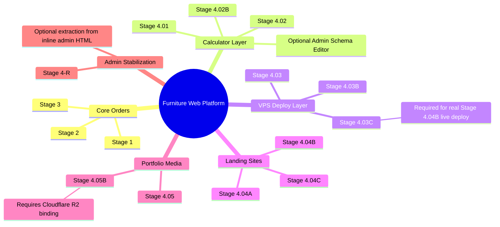

# Furniture Web Platform - NotebookLM Master Context

Last updated: 2026-06-01

This file is the recommended first source for NotebookLM. Upload it together with the master files listed below.

## Project Identity

- Project: Furniture Orders MVP / Furniture Web Platform.
- Repository: `Murkin1980/furniture-orders-mvp`.
- Local repo: `C:\Users\Мурат\OneDrive\Documents\Furniture Web platform\furniture-orders-mvp`.
- Production: `https://furniture-orders-mvp.pages.dev`.
- Admin: `https://furniture-orders-mvp.pages.dev/admin`.
- Runtime stack: Cloudflare Pages, Pages Functions, Cloudflare D1, optional Cloudflare R2, external VPS control service.
- Main database: D1 `furniture_orders`.

## Product Direction

The platform is evolving from a simple furniture order intake MVP into an operational web platform for furniture businesses:

1. accept leads and orders;
2. manage orders and production steps;
3. provide embeddable calculators;
4. manage calculator pricing/schema;
5. control landing-site deployment;
6. publish portfolio/gallery content;
7. later add richer media, template import, AI/multimodal modules, MCP integrations, and full Stage 4 integration checks.

## Current Implementation Status

| Stage | Status | Implemented | Remaining / Follow-up |
|---|---|---|---|
| Stage 1 | Done | Lead intake, clients, orders, Telegram notification. | Maintenance only. |
| Stage 2 | Done | Minimal admin orders panel, status updates, notes. | Maintenance only. |
| Stage 3 | Done | Furniture project templates and order steps. | Possible UI improvements later. |
| Stage 4.01 | Done | Embeddable furniture calculator widget. | Maintenance only. |
| Stage 4.02 | Done | Calculator pricing, rules, draft preview, publish flow. | Base logic is ready. |
| Stage 4.02B | Done | Schema-driven calculator layer, draft/published fields, `schemaVersion`, safe enum contracts. | Optional full admin schema field editor. |
| Stage 4.03 | Partially done | Cloudflare proxy for VPS control API. | Needs real production VPS connection. |
| Stage 4.03B | Code done | Ubuntu-side `vps-control-service` MVP. | Needs install/update on real VPS. |
| Stage 4.03C | Remaining | Operational completion for real VPS. | Configure env, systemd, deploy/reload/logs validation. |
| Stage 4.04A | Done | Landing sites, domains, deployment records. | Maintenance only. |
| Stage 4.04B | Done | Generated HTML artifact and live single-file deploy path. | Real live path depends on Stage 4.03C. |
| Stage 4.04C | Optional / remaining | Multi-file package/zip deploy. | Do when single-file HTML is not enough. |
| Stage 4.05 | Done | Portfolio categories, items, URL images, publish/unpublish, public gallery. | Base gallery is ready. |
| Stage 4.05B | Code done | R2-ready upload endpoint, media metadata, admin upload action. | Configure real R2 bucket/custom domain in Cloudflare. |
| Stage 4-R slice 1-2 | Done | Admin request-layer stabilization through shared helper. | Next refactor slice is optional. |
| Stage 4-R next slice | Remaining tech debt | Extract admin JS/request utilities from inline HTML. | Do later without product behavior changes. |

## Dependency Map

## Important Architecture Boundaries

- Cloudflare Pages Functions are the public/backend API layer.
- D1 stores orders, calculators, sites, deployments, and portfolio data.
- R2 is intended for portfolio media uploads, but real production binding still needs Cloudflare setup.
- The Cloudflare app does not SSH into the VPS. It proxies admin actions to a lightweight VPS control API.
- VPS control service must allowlist actions and source hosts.
- Calculator formulas remain structured and safe. No arbitrary formulas or user-defined code execution.
- Landing deploy currently uses generated single-file HTML artifacts. Multi-file package deploy is a later stage.

## Current Production/Deployment Notes

- Latest completed product code stage: Stage 4.05B.
- Latest pushed code added portfolio media uploads.
- Tests passed after Stage 4.05B: `npm.cmd run check`, `npm.cmd test` with 68 passing tests.
- Remote D1 migration `0010_portfolio_media.sql` was applied.
- Production smoke after deploy:
  - `/` returned 200;
  - `/admin` returned 200;
  - `/api/portfolio` returned 200.
- Real upload in production still requires:
  - Cloudflare Pages R2 binding: `PORTFOLIO_MEDIA_BUCKET`;
  - variable: `PORTFOLIO_MEDIA_PUBLIC_BASE_URL`.

## Recommended Next Work

Cheap start rule: keep fixed costs low by using Cloudflare Pages/Functions + D1 + R2 and one small VPS. The VPS should run control/deploy/MCP orchestration first, not heavy AI inference. AI stages should start with external pay-as-you-go APIs and graceful degradation.

1. Stage 4.03C operational completion:
   - install/update `vps-control-service` on the real Ubuntu VPS;
   - configure `VPS_CONTROL_BASE_URL`;
   - configure `VPS_CONTROL_TOKEN`;
   - validate health/services/live deploy/reload/logs.

2. Stage 4.05B operations:
   - create/select Cloudflare R2 bucket;
   - add Pages binding `PORTFOLIO_MEDIA_BUCKET`;
   - configure public/custom domain;
   - set `PORTFOLIO_MEDIA_PUBLIC_BASE_URL`;
   - verify upload from admin.

3. Stage 4.06 template import/library:
   - start from static/free HTML template assets;
   - store templates in `site_templates`, `template_versions`, `template_assets`;
   - reuse `/api/sites/:id/artifact` and the existing deploy pipeline.

4. Stage 4.07 AI layer:
   - use external pay-as-you-go APIs first;
   - keep intake, CRM, landing and portfolio functional without AI.

5. Stage 4.08/4.09 MCP and SketchUp:
   - use the VPS as an orchestration/control node first;
   - avoid assuming the cheap VPS can handle heavy rendering or local model workloads.

6. Stage 4.10 integration checklist.

Optional technical lanes:
   - Stage 4.04C for multi-file/zip deploy when single-file HTML is not enough;
   - Stage 4-R next slice for admin JS extraction;
   - Stage 4.02B admin schema field editor follow-up.

## Master Files To Upload To NotebookLM

Upload these first:

1. `furniture-platform-notebooklm-master-context.md`
2. `README.md`
3. `furniture-stage4-03C-ops-checklist.md`
4. `furniture-stage4-02B-implementation-plan.md`
5. `vps-control-service/README.md`

Upload these implementation summaries if NotebookLM should understand what was actually built:

6. `furniture-stage4-01-implementation-summary.md`
7. `furniture-stage4-02-implementation-summary.md`
8. `furniture-stage4-02B-implementation-summary.md`
9. `furniture-stage4-03-implementation-summary.md`
10. `furniture-stage4-04-implementation-summary.md`
11. `furniture-stage4-04B-implementation-summary.md`
12. `furniture-stage4-05-implementation-summary.md`
13. `furniture-stage4-05B-implementation-summary.md`
14. `furniture-stage4-R-implementation-summary.md`
15. `furniture-stage4-R-slice2-implementation-summary.md`

Upload these original Stage 4 roadmap/instruction files if NotebookLM should reason about future stages:

16. `..\4 этап\README-stage4-files.md`
17. `..\4 этап\furniture-rebuilt-roadmap.md`
18. `..\4 этап\stage4-01-calculator-widget.md`
19. `..\4 этап\stage4-02-admin-pricing-editor.md`
20. `..\4 этап\stage4-03-vps-control-layer.md`
21. `..\4 этап\stage4-03B-vps-control-service-coding-instructions.md`
22. `..\4 этап\stage4-04-landing-sites-module.md`
23. `..\4 этап\stage4-05-portfolio-gallery-module.md`
24. `..\4 этап\stage4-06-template-import-library.md`
25. `..\4 этап\stage4-07-multimodal-ai-layer.md`
26. `..\4 этап\stage4-08-mcp-module-system.md`
27. `..\4 этап\stage4-09-sketchup-mcp.md`
28. `..\4 этап\stage4-10-stage4-integration-checklist.md`

Optional review/recommendation files:

29. `..\4 этап\furniture-repo-review-recommendations.md`
30. `..\4 этап\furniture-stage4-01-review-recommendations.md`
31. `..\4 этап\stage4-calculators-recommendations.md`
32. `..\4 этап\vps-control-service-recommendations.md`

## Files Not Recommended As Primary NotebookLM Sources

These are useful for handoff/history but can add noise if uploaded too early:

- `*-wip-handoff.md`
- `*-coding-brief.md`
- old dev logs such as `stage4-dev.out.log`, `stage4-dev.err.log`
- raw review notes from early MVP stages unless the question is specifically about those reviews

## Suggested NotebookLM Questions

- What is the current production state of the Furniture Web Platform?
- Which stages are complete and which are still pending?
- What must be done before live VPS deploy is operational?
- What Cloudflare settings are required for portfolio media uploads?
- Which future Stage 4 module should be implemented next and why?
- What are the major architectural boundaries and safety constraints?
